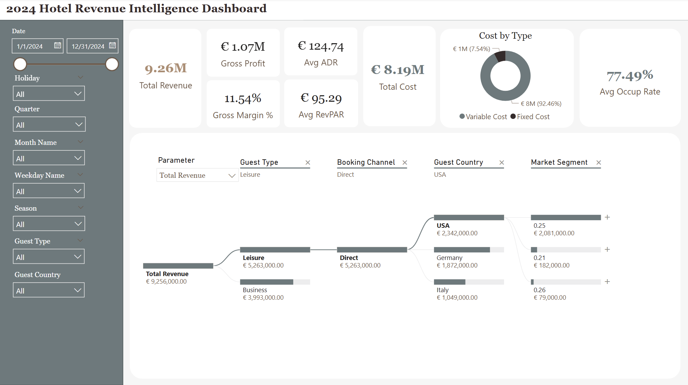

# 🏨 2024 Hotel Revenue Intelligence Dashboard (Power BI)

This project showcases a hotel revenue intelligence dashboard built in **Power BI**, using partially simulated data for the year **2024**. It highlights key performance indicators (KPIs), guest segmentation, cost breakdowns, and seasonal trends.

 

---

## 🧩 Dataset Description

- File: `hotel_aug2024_mar2025.csv`
- Data Range: **January, February, March, and July 2024 only** only
- Some fields are generated or inferred from limited data
- Despite having data for only 4 months (Jan, Feb, Mar, Jul), the **full-year timeline** is displayed on the dashboard to:
  - Maintain consistent time-series x-axis for easier monthly comparisons
  - Reflect a typical business calendar
  - Plan for future dataset expansion

> Note: Date format uses `DD/MM/YYYY`, not `MM/DD/YYYY`. All metrics are estimated based on visible patterns.

---

## 🎯 Why These Metrics?

This dashboard includes:
- **Total Revenue & Gross Profit**: Core financial outcomes
- **ADR & RevPAR**: Industry-standard efficiency metrics
- **Occupancy Rate**: Key utilization insight
- **Cost Structure**: Fixed vs. Variable
- **Filters for Segmentation**: by Season, Country, Booking Channel, Guest Type, etc.

These dimensions were selected to simulate a real-world hotel executive dashboard used for decision-making and strategy.

---

## 📌 Key Insights (2024)

- **Stable Q1 Performance**: Avg Occupancy Rate ≈ **77.78%** with healthy revenue
- **July Revenue Peak**: Strong revenue but limited profit due to high **variable cost**
- **Low Gross Margin**: Only **11.54%**, hinting at possible inefficiencies or rising costs
- **Room Revenue = ~55%**: Suggesting strong alternative income (e.g. F&B, events)
- **Top Guest Countries**:
  - 🇺🇸 USA
  - 🇩🇪 Germany
  - 🇮🇹 Italy  
  Together contribute **65%+** of total revenue — key segments for targeting

---

## 🛠️ Tools Used

- **Power BI** (interactive dashboard design)
- **Python / Pandas** (data generation and preprocessing)
- **Excel** (data cleaning and manual adjustments)

---

## 📁 Project Structure
- data/
  - Hotel book.csv
- screenshots/
  - Screenshot_Executive_Summary.png
  - Screenshot_Deep_Dive_Analysis.png
- README.md

## 👩‍💻 Author

Made by **Jiaman Li**, a data analyst with a passion for building visual storytelling dashboards and turning raw data into actionable insights.

Feel free to fork, reuse, or contribute!
